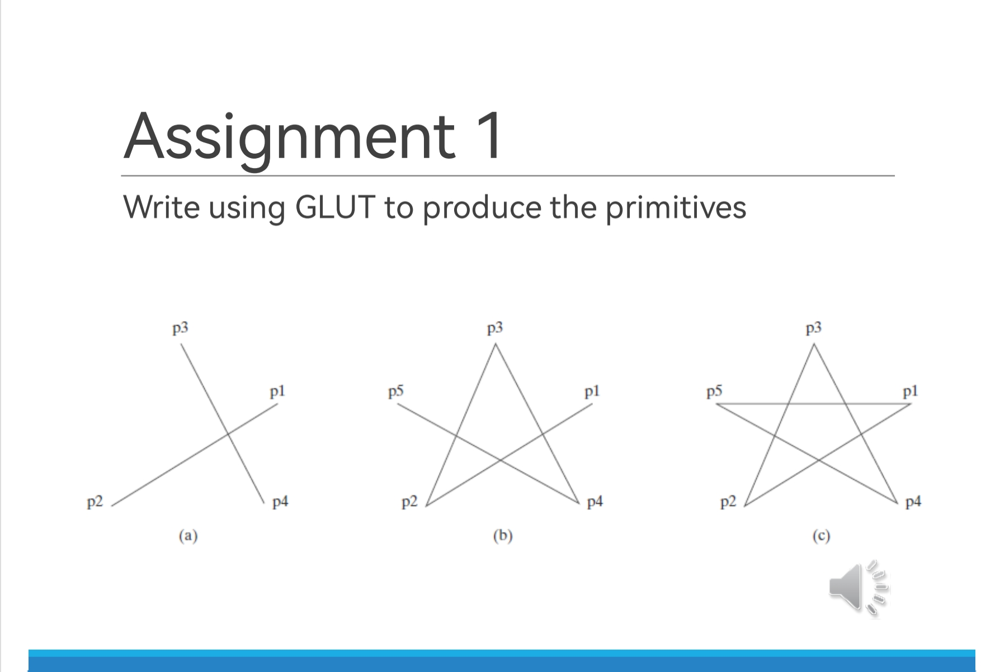

# Assignment 1
## Lecture 2

**- Task 1**
**Write a program using GLUT to display the following Primitives:**


**- Task 2**
**Write a program using GLUT to display the following Primitives:**


## Steps to run the code:
In the terminal run the commands
```bash

cd src\Assignment_1_lec_2
g++ <file_name> .\src\imports.h -o <file_name> -I".\include" -L".\lib\x64" -lfreeglut -lopengl32 -lglu32
./<file_name>
```
or from the root directory
```bash

make -f Makefile

```
The program runs and results are displayed in order, six windows will be opened each representing a part of the tasks.