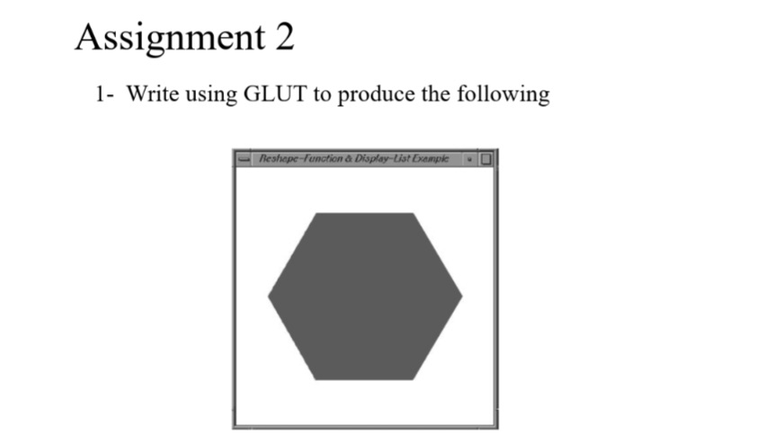
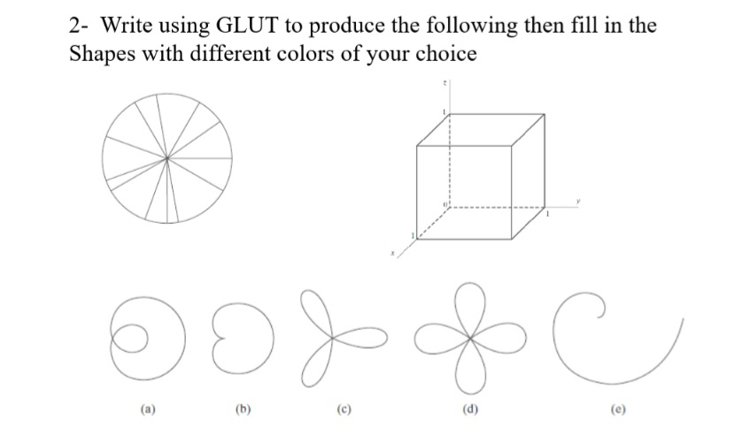

# Assignment 2
## Lecture 3

**- Task 1**
**Write using GLUT to produce the following:**


**- Task 2**
**Write using GLUT to produce the following then fill in the shapes with different colors of your choice:**


## Steps to run the code:
In the terminal run the commands
```bash

cd src/Assignment_2_lec_3
g++ <file_name> .\src\imports.h -o <file_name> -I".\include" -L".\lib\x64" -lfreeglut -lopengl32 -lglu32
./<file_name>

```

or from the root directory


```bash
make -f Makefile

```
The program runs and results are displayed in order, eight windows will be opened each representing a part of the tasks.


# 🎨 GLUT Curve Drawing Project

## ✏️ Curves Rendered

### ➰ (a) Limaçon  
**Equation:** `r = a + b * cos(t)`  
```cpp
for (float t = 0; t <= 2 * M_PI; t += 0.01) {
    float a = 0.5;
    float b = 1.0;
    float r = a + b * cos(t); // Or sin(t) for vertical symmetry
    float x = r * cos(t);
    float y = r * sin(t);
    glVertex2f(x, y);
}

```

---

### ❤️ (b) Cardioid  
**Equation:** `r = 1 - sin(t)`  
```cpp
for (float t = 0; t <= 2 * M_PI; t += 0.01) {
    float r = 1 - sin(t);
    glVertex2f(r * cos(t), r * sin(t));
}
```

---

### 🍀 (c) 3-Leaf Rose  
**Equation:** `r = sin(3t)`  
```cpp
for (float t = 0; t <= 2 * M_PI; t += 0.01) {
    float r = sin(3 * t);
    glVertex2f(r * cos(t), r * sin(t));
}
```

---

### 🌸 (d) 4-Leaf Rose  
**Equation:** `r = sin(2t)`  
```cpp
for (float t = 0; t <= 2 * M_PI; t += 0.01) {
    float r = sin(2 * t);
    glVertex2f(r * cos(t), r * sin(t));
}
```

---

### 🌙 (e) Logarithmic Spiral  
**Equation:** `r = e^(0.1 * t)`  
```cpp
for (float t = 0; t < 4 * M_PI; t += 0.01) {
    float r = exp(0.1 * t);
    glVertex2f(r * cos(t) / 10.0, r * sin(t) / 10.0);  // scaled to fit
}
```

---

## 🎨 Color Tips

Use `glColor3f(r, g, b)` to set the color before plotting:
```cpp
glColor3f(1.0, 0.0, 0.0); // red
```

You can assign a different color to each shape!

---

## 💡 Optional Add-ons

- 🔄 Animate the curves with `glutTimerFunc()`
- 🧩 Add interactivity with keyboard/mouse callbacks
- 📸 Export images using screen capture tools

---
