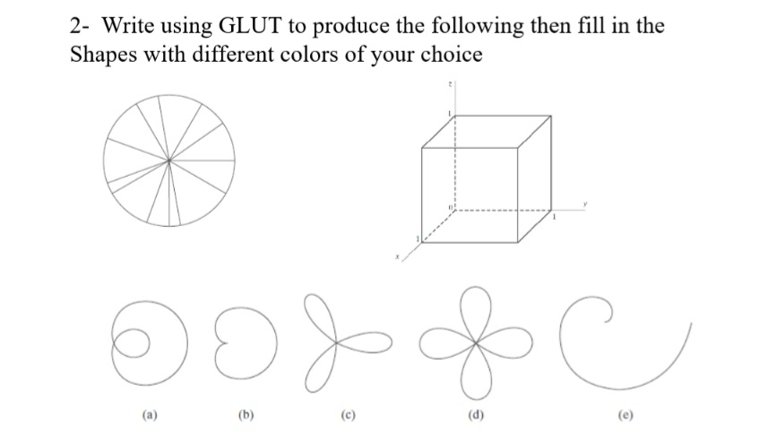

# Assignment 2
## Lecture 3

**- Task 1**
**Write using GLUT to produce the following:**


**- Task 2**
**Write using GLUT to produce the following then fill in the shapes with different colors of your choice:**


## Steps to run the code:
In the terminal run the commands
```bash

cd src\Assignment_1_lec_2
make -f Makefile

```
The program runs and results are displayed in order, six windows will be opened each representing a part of the tasks.