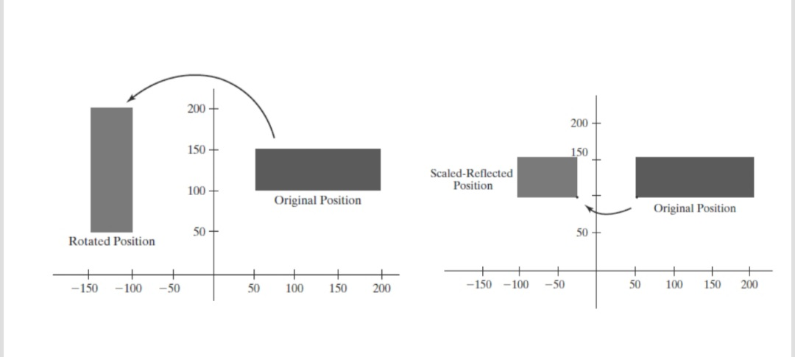

# Assignment 3
## Lecture 5

**- Task 1**
**Write using GLUT to produce the following then fill in the rectangle with different colors of your choice:**



## Steps to run the code:
In the terminal run the commands
```bash

cd src\Assignment_3_lec_5
g++ <file_name> .\src\imports.h -o <file_name> -I".\include" -L".\lib\x64" -lfreeglut -lopengl32 -lglu32
./<file_name>

```

or from the root directory


```bash
make -f Makefile

```
The program runs and results are displayed in order, three windows will be opened each representing a part of the tasks.